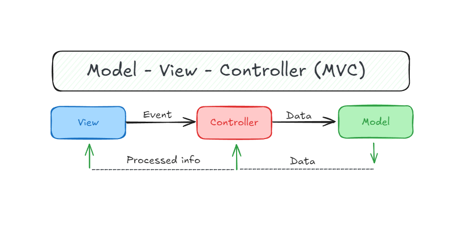

### 🧩 **Modelo-Vista-Controlador (MVC)**

**MVC** es un patrón de diseño arquitectónico que **organiza el código** de una aplicación en tres componentes principales para **separar responsabilidades** y facilitar el mantenimiento, la escalabilidad y las pruebas del software.

---

### 🧱 Sus tres componentes:

1. **Modelo (Model)**

    - Es la **lógica del negocio** y los **datos** de la aplicación.

    - Se encarga de gestionar el estado de la app y comunicarse con la base de datos o cualquier fuente de datos.

    - No depende de cómo se muestran los datos ni cómo se ingresan.

2. **Vista (View)**

    - Es la **interfaz de usuario** (lo que el usuario ve y con lo que interactúa).

    - Muestra los datos que vienen del modelo.

    - No contiene lógica de negocio, solo presentación.

3. **Controlador (Controller)**

    - Es el **intermediario** entre la vista y el modelo.

    - Recibe las acciones del usuario desde la vista (como clics o formularios).

    - Llama al modelo para actualizar datos y luego actualiza la vista.

---

### 🔁 ¿Cómo interactúan?

1. El usuario interactúa con la **vista**.

2. La vista envía la acción al **controlador**.

3. El controlador procesa la acción y se comunica con el **modelo**.

4. El modelo actualiza su estado y, si es necesario, el controlador le indica a la vista que se actualice.

---

### 🎯 ¿Para qué sirve?

- **Separar responsabilidades** (presentación, lógica y control).

- Hacer que el código sea más limpio, mantenible y fácil de testear.

- Facilitar el trabajo en equipo (diseñadores en la vista, desarrolladores en el modelo/controlador).